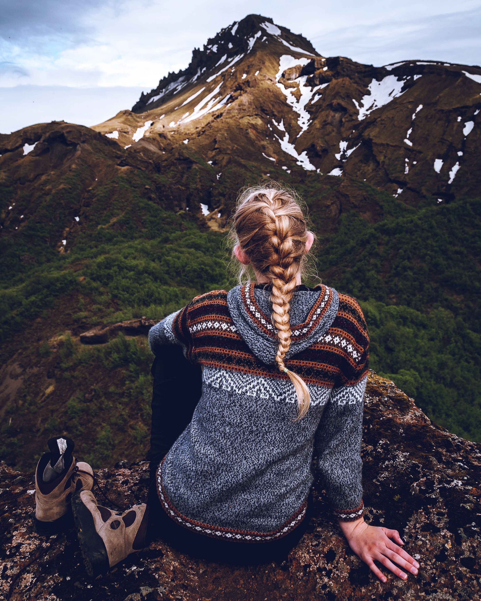

# Recent

It's very easy to make some words **bold** and other words _italic_ with Markdown. You can even link to [Mikula](https://github.com/RomanKosobrodov/mikula)!

## Section 1.1

This is subsection of the recent post

### Section 1.1.1

This is subsection of Section 1.1.

## Emphasis

_This text will be italic_
_This will also be italic_

**This text will be bold**
**This will also be bold**

_You **can** combine them_

## Lists

They can be unordered

- Item 1
- Item 2
  - Item 2a
  - Item 2b

And ordered

1. Item 1
1. Item 2
1. Item 3
   1. Item 3a
   1. Item 3b

## Backquotes

> But man is not made for defeat.
> A man can be destroyed but not defeated.

Ernest Hemingway

## Images

Images can be put in `blog-assets` folder:

(Photo by <a href="https://unsplash.com/@efranciswork?utm_source=unsplash&utm_medium=referral&utm_content=creditCopyText">Emma Francis</a> on <a href="https://unsplash.com/?utm_source=unsplash&utm_medium=referral&utm_content=creditCopyText">Unsplash</a>)

Alternatively, a path relative to the current markdown file can be given

(Photo by <a href="https://unsplash.com/@zamax?utm_source=unsplash&utm_medium=referral&utm_content=creditCopyText">Gustavo Zambelli</a> on <a href="https://unsplash.com/?utm_source=unsplash&utm_medium=referral&utm_content=creditCopyText">Unsplash</a>)

## Resources

Files for download can be included in a similar way, for example [text file](blog-assets/document.txt) or [image](angele-kamp-bDuh4oK_MCU-unsplash.jpg). This could be useful if you want to provide a link to a full-resolution file or a image in raw format.

## Credits

Post Image <a href="https://unsplash.com/@romanbolozan?utm_source=unsplash&utm_medium=referral&utm_content=creditCopyText">Roman Bolozan</a> on <a href="https://unsplash.com/?utm_source=unsplash&utm_medium=referral&utm_content=creditCopyText">Unsplash</a>

Sample download image <a href="https://unsplash.com/@angelekamp?utm_source=unsplash&utm_medium=referral&utm_content=creditCopyText">Angèle Kamp</a> on <a href="https://unsplash.com/s/photos/frame?utm_source=unsplash&utm_medium=referral&utm_content=creditCopyText">Unsplash</a>
